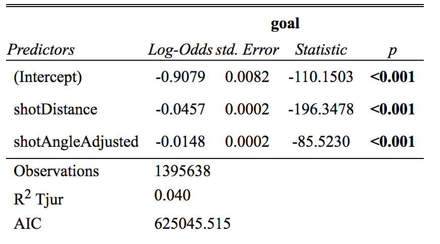
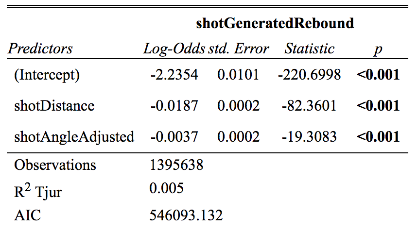

```{r setup, include=FALSE}
options(htmltools.dir.version = FALSE)
knitr::opts_chunk$set(
    fig.retina = 3,
    out.width = "100%",
    cache = FALSE,
    echo = FALSE,
    message = FALSE,
    warning = FALSE,
    fig.show = TRUE,
    hiline = TRUE)
```

```{r xaringan-themer, include = FALSE, warning = FALSE}
library(xaringanthemer)
style_mono_accent(base_color = "#808080",
  white_color = "#FFFFFF",
  background_color = "#fff7e6",
  base_font_size = "24px"
)
```


## Bootstrapping
 - Any test or metric that uses sampling with replacement
 - Assigns measures of accuracy to sample estimates
 - Allows estimation of sampling distribution of any statistic using random sampling
 
---


```{r include = FALSE, warning = FALSE}
# for setting up data
library(tidyverse)
library(data.table)
shots <- read_csv("shots_data/shots_2020.csv")
shots2020 <- read_csv("shots_data/shots_2020.csv")
shots0719 <- read.csv("shots_data/shots_2007-2019.csv")
```

```{r}
shots2020 <-
  shots2020 %>%
  mutate(Position = ifelse(playerPositionThatDidEvent == "D", "D", "F"))
```


```{r include = FALSE, warning = FALSE}
# Subsets for calibration
hometeam <- subset(shots2020, team == "HOME")
awayteam <- subset(shots2020, team = "AWAY")
evenstrength <-  shots2020 %>%
  filter(homeSkatersOnIce == 5,
        awaySkatersOnIce == 5)
powerplay <-  shots2020 %>%
  filter(homeSkatersOnIce == 5,
         awaySkatersOnIce == 4,
         isHomeTeam == 1)
penaltykill <-  shots2020 %>%
  filter(homeSkatersOnIce == 4,
         awaySkatersOnIce == 5,
         isHomeTeam == 1)
backhand <- shots2020 %>%
  filter(shotType == "BACK")
deflection <- shots2020 %>%
  filter(shotType == "DEFL")
slapshot <- shots2020 %>%
  filter(shotType == "SLAP")
snapshot <- shots2020 %>%
  filter(shotType == "SNAP")
tip <- shots2020 %>%
  filter(shotType == "TIP")
wristshot <- shots2020 %>%
  filter(shotType == "WRIST")
wrap <- shots2020 %>%
  filter(shotType == "WRAP")
forward <- shots2020 %>%
  filter(Position == "F")
defense <- shots2020 %>%
  filter(Position == "D")

lefthand <- subset(shots, shooterLeftRight == "L")
righthand <- subset(shots, shooterLeftRight == "R")


```

class: left, top
## NHL Shots Data
* <p> Each row represents a shot puck in the NHL
* <p> Calibration plots only include shots and the xG model from 2020-21 season
* <p> Made basic logistic regression models with rebound and goals as response variables, distance and angle as explanatory
* <p> Looked at seasons from 2009-2019 to see if the coefficients for these logistic regression models change over time

---

## Calibration of Moneypuck xG Model

--

```{r echo = FALSE, out.width = "60%", fig.align="center"}
shots2020 %>%
  mutate(
         bin_pred_prob = round(xGoal / 0.05) * 0.05) %>%
  group_by(bin_pred_prob) %>%
  summarize(n_attempts = n(),
            bin_actual_prob = mean(goal)) %>%
  ggplot(aes(x = bin_pred_prob, y = bin_actual_prob)) + 
  geom_point(aes(size = n_attempts)) + 
  geom_text(aes(label = n_attempts),
            position = position_nudge(x = 0.05, y = -0.05),
            size = 2)+
  geom_smooth(method = "loess", se = FALSE) + 
  geom_abline(intercept = 0, slope = 1, color = "darkred",
              linetype = "dashed") + 
  theme_bw() + 
  coord_equal() + 
  scale_x_continuous(limits = c(0,1)) +
  scale_y_continuous(limits = c(0, 1)) + 
  theme(legend.position = "bottom") + 
  labs(x = "Predicted Probability",
       y = "Actual Probability",
       size = "Number of Attempts")
```

---

class: center, middle

# Calibration on subsets

---

## Team

### Home vs. Away
```{r echo = FALSE, fig.show="hold", out.width = "50%"}
hometeam %>%
  mutate(
    bin_pred_prob = round(xGoal / 0.05) * 0.05) %>%
  group_by(bin_pred_prob) %>%
  summarize(n_attempts = n(),
            bin_actual_prob = mean(goal)) %>%
  ggplot(aes(x = bin_pred_prob, y = bin_actual_prob)) + 
  geom_point(aes(size = n_attempts)) + 
  geom_text(aes(label = n_attempts),
            position = position_nudge(x = 0.05, y = -0.05),
            size = 2) +
  geom_smooth(method = "loess", se = FALSE) + 
  geom_abline(intercept = 0, slope = 1, color = "darkred",
              linetype = "dashed") + 
  theme_bw() + 
  coord_equal() + 
  scale_x_continuous(limits = c(0,1)) +
  scale_y_continuous(limits = c(0, 1)) + 
  theme(legend.position = "bottom") +
    labs(x = "Predicted Probability",
       y = "Actual Probability",
       title="Home Team",
       size = "Number of Attempts",
      plot.title = element_text(size = 20,face = "bold"),
      axis.title.x = element_text(size=16),
      axis.title.y = element_text(size=16))

awayteam %>%
  mutate(
    bin_pred_prob = round(xGoal / 0.05) * 0.05) %>%
  group_by(bin_pred_prob) %>%
  summarize(n_attempts = n(),
            bin_actual_prob = mean(goal)) %>%
  ggplot(aes(x = bin_pred_prob, y = bin_actual_prob)) + 
  geom_point(aes(size = n_attempts)) + 
  geom_text(aes(label = n_attempts),
            position = position_nudge(x = 0.05, y = -0.05),
            size = 2) +
  geom_smooth(method = "loess", se = FALSE) + 
  geom_abline(intercept = 0, slope = 1, color = "darkred",
              linetype = "dashed") + 
  theme_bw() + 
  coord_equal() + 
  scale_x_continuous(limits = c(0,1)) +
  scale_y_continuous(limits = c(0, 1)) + 
  theme(legend.position = "bottom") +
    labs(x = "Predicted Probability",
       y = "Actual Probability",
       size = "Number of Attempts",
       title="Away Team")
```

---

layout: true

## Situation 

---

### Even Strength

```{r out.width = "50%", fig.align="center"}
evenstrength %>%
  mutate(bin_pred_prob = round(xGoal / 0.05) * 0.05) %>%
  group_by(bin_pred_prob) %>%
  summarize(n_attempts = n(),
            bin_actual_prob = mean(goal)) %>%
  ggplot(aes(x = bin_pred_prob, y = bin_actual_prob)) + 
  geom_point(aes(size = n_attempts)) + 
  geom_text(aes(label = n_attempts),
            position = position_nudge(x = 0.1, y = -0.01),
            size = 2) +
  geom_smooth(method = "loess", se = FALSE) + 
  geom_abline(intercept = 0, slope = 1, color = "darkred",
              linetype = "dashed") + 
  theme_bw() + 
  coord_equal() + 
  scale_x_continuous(limits = c(0,1)) +
  scale_y_continuous(limits = c(0, 1)) + 
  theme(legend.position = "bottom") +
  labs(x = "Predicted Probability",
       y = "Actual Probability",
       size = "Number of Attempts",
       title="Even Strength")
```

---

### Powerplay and Penalty Kill

```{r, fig.show="hold", out.width = "50%"}
powerplay %>%
  mutate(bin_pred_prob = round(xGoal / 0.05) * 0.05) %>%
  group_by(bin_pred_prob) %>%
  summarize(n_attempts = n(),
            bin_actual_prob = mean(goal)) %>%
  ggplot(aes(x = bin_pred_prob, y = bin_actual_prob)) + 
  geom_point(aes(size = n_attempts)) + 
  geom_text(aes(label = n_attempts),
            position = position_nudge(x = 0.05, y = -0.05),
            size = 2) +
  geom_smooth(method = "loess", se = FALSE) + 
  geom_abline(intercept = 0, slope = 1, color = "darkred",
              linetype = "dashed") + 
  theme_bw() + 
  coord_equal() + 
  scale_x_continuous(limits = c(0,1)) +
  scale_y_continuous(limits = c(0, 1)) + 
  theme(legend.position = "bottom") +
  labs(x = "Predicted Probability",
       y = "Actual Probability",
       size = "Number of Attempts",
       title="Powerplay")

penaltykill %>%
  mutate(bin_pred_prob = round(xGoal / 0.05) * 0.05) %>%
  group_by(bin_pred_prob) %>%
  summarize(n_attempts = n(),
            bin_actual_prob = mean(goal)) %>%
  ggplot(aes(x = bin_pred_prob, y = bin_actual_prob)) + 
  geom_point(aes(size = n_attempts)) + 
  geom_text(aes(label = n_attempts),
            position = position_nudge(x = 0.07, y = -0.02),
            size = 2) +
  geom_smooth(method = "loess", se = FALSE) + 
  geom_abline(intercept = 0, slope = 1, color = "darkred",
              linetype = "dashed") + 
  theme_bw() + 
  coord_equal() + 
  scale_x_continuous(limits = c(0,1)) +
  scale_y_continuous(limits = c(0, 1)) + 
  theme(legend.position = "bottom") +
  labs(x = "Predicted Probability",
       y = "Actual Probability",
       size = "Number of Attempts",
       title="Penalty Kill")
```

---

layout: true

##Shot Type

---

### Wristshot and Slapshot

```{r, fig.show="hold", out.width = "50%"}
wristshot %>%
  mutate(
         bin_pred_prob = round(xGoal / 0.05) * 0.05) %>%
  group_by(bin_pred_prob) %>%
  summarize(n_attempts = n(),
            bin_actual_prob = mean(goal)) %>%
  ggplot(aes(x = bin_pred_prob, y = bin_actual_prob)) + 
  geom_point(aes(size = n_attempts)) + 
  geom_text(aes(label = n_attempts),
            position = position_nudge(x = 0.05, y = -0.05),
            size = 2)+
  geom_smooth(method = "loess", se = FALSE) + 
  geom_abline(intercept = 0, slope = 1, color = "darkred",
              linetype = "dashed") + 
  theme_bw() + 
  coord_equal() + 
  scale_x_continuous(limits = c(0,1)) +
  scale_y_continuous(limits = c(0, 1)) + 
  theme(legend.position = "bottom") + 
  labs(x = "Predicted Probability",
       y = "Actual Probability",
       size = "Number of Attempts",
       title="Wristshot")

slapshot %>%
  mutate(
         bin_pred_prob = round(xGoal / 0.05) * 0.05) %>%
  group_by(bin_pred_prob) %>%
  summarize(n_attempts = n(),
            bin_actual_prob = mean(goal)) %>%
  ggplot(aes(x = bin_pred_prob, y = bin_actual_prob)) + 
  geom_point(aes(size = n_attempts)) + 
  geom_text(aes(label = n_attempts),
            position = position_nudge(x = 0.05, y = -0.05),
            size = 2)+
  geom_smooth(method = "loess", se = FALSE) + 
  geom_abline(intercept = 0, slope = 1, color = "darkred",
              linetype = "dashed") + 
  theme_bw() + 
  coord_equal() + 
  scale_x_continuous(limits = c(0,1)) +
  scale_y_continuous(limits = c(0, 1)) + 
  theme(legend.position = "bottom") + 
  labs(x = "Predicted Probability",
       y = "Actual Probability",
       size = "Number of Attempts",
       title="Slapshot")
```

---

### Backhand and Snapshot

```{r, fig.show="hold", out.width = "50%"}
backhand %>%
  mutate(
         bin_pred_prob = round(xGoal / 0.05) * 0.05) %>%
  group_by(bin_pred_prob) %>%
  summarize(n_attempts = n(),
            bin_actual_prob = mean(goal)) %>%
  ggplot(aes(x = bin_pred_prob, y = bin_actual_prob)) + 
  geom_point(aes(size = n_attempts)) + 
  geom_text(aes(label = n_attempts),
            position = position_nudge(x = 0.05, y = -0.05),
            size = 2)+
  geom_smooth(method = "loess", se = FALSE) + 
  geom_abline(intercept = 0, slope = 1, color = "darkred",
              linetype = "dashed") + 
  theme_bw() + 
  coord_equal() + 
  scale_x_continuous(limits = c(0,1)) +
  scale_y_continuous(limits = c(0, 1)) + 
  theme(legend.position = "bottom") + 
  labs(x = "Predicted Probability",
       y = "Actual Probability",
       size = "Number of Attempts",
       title="Backhand")

snapshot %>%
  mutate(
         bin_pred_prob = round(xGoal / 0.05) * 0.05) %>%
  group_by(bin_pred_prob) %>%
  summarize(n_attempts = n(),
            bin_actual_prob = mean(goal)) %>%
  ggplot(aes(x = bin_pred_prob, y = bin_actual_prob)) + 
  geom_point(aes(size = n_attempts)) + 
  geom_text(aes(label = n_attempts),
            position = position_nudge(x = 0.05, y = -0.05),
            size = 2)+
  geom_smooth(method = "loess", se = FALSE) + 
  geom_abline(intercept = 0, slope = 1, color = "darkred",
              linetype = "dashed") + 
  theme_bw() + 
  coord_equal() + 
  scale_x_continuous(limits = c(0,1)) +
  scale_y_continuous(limits = c(0, 1)) + 
  theme(legend.position = "bottom") + 
  labs(x = "Predicted Probability",
       y = "Actual Probability",
       size = "Number of Attempts",
       title="Snapshot")
```

---


### Tip and Wraparound
```{r, fig.show="hold", out.width = "50%"}
tip %>%
  mutate(
         bin_pred_prob = round(xGoal / 0.05) * 0.05) %>%
  group_by(bin_pred_prob) %>%
  summarize(n_attempts = n(),
            bin_actual_prob = mean(goal)) %>%
  ggplot(aes(x = bin_pred_prob, y = bin_actual_prob)) + 
  geom_point(aes(size = n_attempts)) + 
  geom_text(aes(label = n_attempts),
            position = position_nudge(x = 0.05, y = -0.05),
            size = 2)+
  geom_smooth(method = "loess", se = FALSE) + 
  geom_abline(intercept = 0, slope = 1, color = "darkred",
              linetype = "dashed") + 
  theme_bw() + 
  coord_equal() + 
  scale_x_continuous(limits = c(0,1)) +
  scale_y_continuous(limits = c(0, 1)) + 
  theme(legend.position = "bottom") + 
  labs(x = "Predicted Probability",
       y = "Actual Probability",
       size = "Number of Attempts",
       title="Tip")

wrap %>%
  mutate(
         bin_pred_prob = round(xGoal / 0.05) * 0.05) %>%
  group_by(bin_pred_prob) %>%
  summarize(n_attempts = n(),
            bin_actual_prob = mean(goal)) %>%
  ggplot(aes(x = bin_pred_prob, y = bin_actual_prob)) + 
  geom_point(aes(size = n_attempts)) + 
  geom_text(aes(label = n_attempts),
            position = position_nudge(x = 0.05, y = -0.05),
            size = 2)+
  geom_smooth(method = "loess", se = FALSE) + 
  geom_abline(intercept = 0, slope = 1, color = "darkred",
              linetype = "dashed") + 
  theme_bw() + 
  coord_equal() + 
  scale_x_continuous(limits = c(0,1)) +
  scale_y_continuous(limits = c(0, 1)) + 
  theme(legend.position = "bottom") + 
  labs(x = "Predicted Probability",
       y = "Actual Probability",
       size = "Number of Attempts",
       title="Wraparound")
```

---

### Deflection

```{r out.width = "50%", fig.align="center" }

deflection %>%
  mutate(
         bin_pred_prob = round(xGoal / 0.05) * 0.05) %>%
  group_by(bin_pred_prob) %>%
  summarize(n_attempts = n(),
            bin_actual_prob = mean(goal)) %>%
  ggplot(aes(x = bin_pred_prob, y = bin_actual_prob)) + 
  geom_point(aes(size = n_attempts)) + 
  geom_text(aes(label = n_attempts),
            position = position_nudge(x = 0.05, y = -0.05),
            size = 2)+
  geom_smooth(method = "loess", se = FALSE) + 
  geom_abline(intercept = 0, slope = 1, color = "darkred",
              linetype = "dashed") + 
  theme_bw() + 
  coord_equal() + 
  scale_x_continuous(limits = c(0,1)) +
  scale_y_continuous(limits = c(0, 1)) + 
  theme(legend.position = "bottom") + 
  labs(x = "Predicted Probability",
       y = "Actual Probability",
       size = "Number of Attempts",
      plot.title = element_text(size = 20,face = "bold"),
      axis.title.x = element_text(size=16),
      axis.title.y = element_text(size=16),
      title="Deflection")

```

---

layout: false

## Position

### Forwards vs Defense

```{r, fig.show="hold", out.width = "50%"}
forward %>%
  mutate(
         bin_pred_prob = round(xGoal / 0.05) * 0.05) %>%
  group_by(bin_pred_prob) %>%
  summarize(n_attempts = n(),
            bin_actual_prob = mean(goal)) %>%
  ggplot(aes(x = bin_pred_prob, y = bin_actual_prob)) + 
  geom_point(aes(size = n_attempts)) + 
  geom_text(aes(label = n_attempts),
            position = position_nudge(x = 0.05, y = -0.05),
            size = 2)+
  geom_smooth(method = "loess", se = FALSE) + 
  geom_abline(intercept = 0, slope = 1, color = "darkred",
              linetype = "dashed") + 
  theme_bw() + 
  coord_equal() + 
  scale_x_continuous(limits = c(0,1)) +
  scale_y_continuous(limits = c(0, 1)) + 
  theme(legend.position = "bottom") + 
  labs(x = "Predicted Probability",
       y = "Actual Probability",
       size = "Number of Attempts",
       title="Forwards")

defense %>%
  mutate(
         bin_pred_prob = round(xGoal / 0.05) * 0.05) %>%
  group_by(bin_pred_prob) %>%
  summarize(n_attempts = n(),
            bin_actual_prob = mean(goal)) %>%
  ggplot(aes(x = bin_pred_prob, y = bin_actual_prob)) + 
  geom_point(aes(size = n_attempts)) + 
  geom_text(aes(label = n_attempts),
            position = position_nudge(x = 0.05, y = -0.05),
            size = 2)+
  geom_smooth(method = "loess", se = FALSE) + 
  geom_abline(intercept = 0, slope = 1, color = "darkred",
              linetype = "dashed") + 
  theme_bw() + 
  coord_equal() + 
  scale_x_continuous(limits = c(0,1)) +
  scale_y_continuous(limits = c(0, 1)) + 
  theme(legend.position = "bottom") + 
  labs(x = "Predicted Probability",
       y = "Actual Probability",
       size = "Number of Attempts",
       title="Defense")
```

---

## Handedness

### Left vs. Righthand

```{r,  fig.show="hold", out.width = "50%"}
lefthand %>%
  mutate(
         bin_pred_prob = round(xGoal / 0.05) * 0.05) %>%
  group_by(bin_pred_prob) %>%
  summarize(n_attempts = n(),
            bin_actual_prob = mean(goal)) %>%
  ggplot(aes(x = bin_pred_prob, y = bin_actual_prob)) + 
  geom_point(aes(size = n_attempts)) + 
  geom_text(aes(label = n_attempts),
            position = position_nudge(x = 0.05, y = -0.05),
            size = 2)+
  geom_smooth(method = "loess", se = FALSE) + 
  geom_abline(intercept = 0, slope = 1, color = "darkred",
              linetype = "dashed") + 
  theme_bw() + 
  coord_equal() + 
  scale_x_continuous(limits = c(0,1)) +
  scale_y_continuous(limits = c(0, 1)) + 
  theme(legend.position = "bottom") + 
  labs(x = "Predicted Probability",
       y = "Actual Probability",
       size = "Number of Attempts",
       title="Lefthand")

righthand %>%
  mutate(
         bin_pred_prob = round(xGoal / 0.05) * 0.05) %>%
  group_by(bin_pred_prob) %>%
  summarize(n_attempts = n(),
            bin_actual_prob = mean(goal)) %>%
  ggplot(aes(x = bin_pred_prob, y = bin_actual_prob)) + 
  geom_point(aes(size = n_attempts)) + 
  geom_text(aes(label = n_attempts),
            position = position_nudge(x = 0.05, y = -0.05),
            size = 2)+
  geom_smooth(method = "loess", se = FALSE) + 
  geom_abline(intercept = 0, slope = 1, color = "darkred",
              linetype = "dashed") + 
  theme_bw() + 
  coord_equal() + 
  scale_x_continuous(limits = c(0,1)) +
  scale_y_continuous(limits = c(0, 1)) + 
  theme(legend.position = "bottom") + 
  labs(x = "Predicted Probability",
       y = "Actual Probability",
       size = "Number of Attempts",
       title="Righthand")
```

---

## Are Any Rinks Poorly Calibrated? 

---

### Basic xG Model with Logistic Regression  
###### &nbsp; 



---

### Rebound Probability Model with Logistic Regression



---

### xG Coefficient Trends Over Time

```{r echo=FALSE}

shots1019 <- shots0719 %>% 
  filter(season>2009)

recent_season <- rbind(select(shots1019,season,shotAngleAdjusted,arenaAdjustedShotDistance,goal,shotGeneratedRebound),select(shots2020,season,shotAngleAdjusted,arenaAdjustedShotDistance,goal,shotGeneratedRebound))

dat_list = split(recent_season, recent_season$season)
```

```{r echo=FALSE,fig.align="center", fig.show="hold", out.width="80%",fig.width = 9, fig.height = 3.5}
init_logit <- map(dat_list, ~glm(goal ~                        shotAngleAdjusted+arenaAdjustedShotDistance,
                                 data = .x,
                                 family = binomial("logit")) )

distance<- rep(NA,11)
angle<-rep(NA,11)

for (i in 1:11){
  distance[i] <- init_logit[[i]]$coefficients[3]
  angle[i]<- init_logit[[i]]$coefficients[2]
}

coefficients<- data.frame(season= as.factor(2010:2020) ,distance_c= distance, angle_c = angle)

ggplot(coefficients,aes(x=season,y=distance_c))+
  geom_point()+
  geom_line(aes(group=1))+
  labs(title = "Distance",
       x = "Season",
       y = "Shot Distance Coefficient")+
  theme_bw()+
  theme(axis.title.x = element_text(size=16),
           axis.title.y = element_text(size=16),
           plot.title = element_text(size = 20,face = "bold"))
  
ggplot(coefficients,aes(x=season,y=angle_c))+
  geom_point()+
  geom_line(aes(group=1))+
  labs(title = "Angle",
       x = "Season",
       y = "Shot Angle Coefficient")+
  theme_bw()+
  theme(axis.title.x = element_text(size=16),
           axis.title.y = element_text(size=16),
           plot.title = element_text(size = 20, face = "bold"))

```

---

### Rebound Coefficient Trends Over Time


```{r echo=FALSE,fig.align="center", fig.show="hold", out.width="80%",fig.width = 9, fig.height = 3.5}

init_logit <- map(dat_list, ~glm(shotGeneratedRebound ~                        shotAngleAdjusted+arenaAdjustedShotDistance,
                                 data = .x,
                                 family = binomial("logit")) )

distance<- rep(NA,11)
angle<-rep(NA,11)

for (i in 1:11){
  distance[i] <- init_logit[[i]]$coefficients[3]
  angle[i]<- init_logit[[i]]$coefficients[2]
}

coefficients<- data.frame(season= as.factor(2010:2020) ,distance_c= distance, angle_c = angle)

ggplot(coefficients,aes(x=season,y=distance_c))+
  geom_point()+
  geom_line(aes(group=1))+
  labs(title = "Distance",
       x = "Season",
       y = "Shot Distance Coefficient")+
  theme_bw()+
  theme(axis.title.x = element_text(size=16),
           axis.title.y = element_text(size=16),
           plot.title = element_text(size = 20,face = "bold"))
  
ggplot(coefficients,aes(x=season,y=angle_c))+
  geom_point()+
  geom_line(aes(group=1))+
  labs(title = "Angle",
       x = "Season",
       y = "Shot Angle Coefficient")+
  theme_bw()+
  theme(axis.title.x = element_text(size=16),
           axis.title.y = element_text(size=16),
           plot.title = element_text(size = 20,face = "bold"))
```


